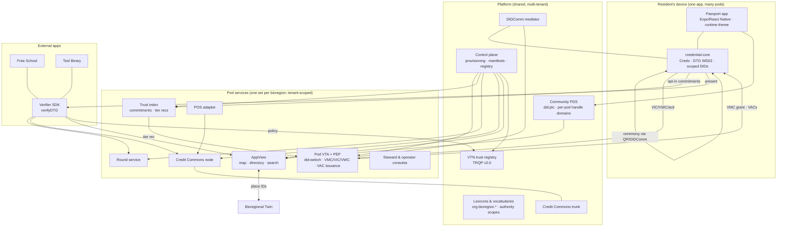

# Bioregional Passport — Technical Architecture

**Build set B2 of 4 · v1.0 draft · 22 September 2026**
**Author:** Benjamin Life (@omniharmonic)
**Consolidates:** architecture (03 v0.3), identity layer (06), POS brief (04). Supersedes doc 03 as the build source of truth; ADRs 1–14 carry forward, ADR 15–20 added here.
**Companions:** B1 PRD · B3 Protocol & Schema Reference · B4 Implementation Plan

---

## 1. Architecture in one picture



**Three planes, unchanged:** Trust (credentials in wallets; never on the firehose), Open (ATProto records; anyone reads), Value (ledger and rounds; gated by presentations). **One new axis: tenancy.** Everything in the Pod box is scoped to a bioregion; everything in the Platform box is shared and holds no pod-private data except operator configuration.

## 2. Tenancy model

### 2.1 Definitions
- **Pod** — a bioregion's deployment: a VTC (`did:webvh`), a manifest, a set of pod services, a ledger, a theme, a governance document and a trust policy. Slug is globally unique (`boulder`, `front-range-north`).
- **Platform** — the shared control plane, registry, mediator, PDS, lexicon hosting and Credit Commons trunk, run by the Commons Operator. A pod can leave with its DID, data and ledger (ADR 15).
- **Tenant zero** — a synthetic pod provisioned in CI on every release to prove multi-tenancy; it is never deleted.

### 2.2 Isolation strategy (ADR 16)
| Layer | Choice | Reason |
|---|---|---|
| Identity | One `did:webvh` per pod; witnesses = platform VTA + one pod anchor | Sovereignty; verifiable history |
| Compute | Shared stateless services with tenant context from the request (host header, DID, or JWT) | Cheap to operate at 1–20 pods |
| Data | **Postgres schema per pod** on Neon (`pod_boulder.*`), row-level security as a second fence; per-pod object-storage prefix | Hard isolation without per-pod clusters; easy export |
| Ledger | **Dedicated Credit Commons node per pod**, nested under a platform trunk | Money must not share tables; nesting enables future inter-pod trade |
| AppView | One index, `bioregion` column on every record, per-pod materialised views | Cross-pod discovery is a feature (map of all pods) but defaults off |
| Secrets | Per-pod KMS keys for issuer signing; PEP signs with the pod DID's `assertionMethod` key held in KMS | Blast-radius containment |
| Front end | One mobile binary, runtime manifest; optional white-label build; per-pod web domains | Day-one custom front ends without forks |

### 2.3 Request scoping
Every pod-service request carries `X-Pod: <slug>` derived from (in order): custom domain → `<slug>.<platform-domain>` → DID in the presentation → explicit header from the app. Services refuse requests whose credentials name a different pod DID than the resolved tenant.

## 3. Bioregion manifest — the front-end contract

The manifest is the single artifact that makes a pod a pod. Signed by the pod DID; published at `https://<pod-domain>/.well-known/bioregion.json`; cached by the app; validated against the schema in B3 §7. Full example there; the sections:

| Section | Drives |
|---|---|
| `identity` — slug, display name, DID, handle domain, contact | Everything |
| `theme` — colour tokens, typography, logo, icon, splash, tone ("warm/civic/plain") | App and web theming at runtime; white-label build inputs |
| `copy` — overrides for named strings (`cta.findEvent`, `tier.T2.name`…) in one or more locales | Localised, pod-voiced UI |
| `place` — bioregion polygon ref, watershed registry source (Twin `resolve_point` or static HUC set), map bounds, default zoom | Map, place IDs on records |
| `modules` — grants, circulation, map, merchant, thirdParty[] | Launcher contents; feature flags |
| `trustPolicy` — URL of the signed policy (thresholds, seed set, weights, validity windows, IDVC switch) | Index + PEP behaviour |
| `currency` — unit name, parity note, starter limits L1–L3, default acceptance shares, offline allowance, node endpoint | Circulation |
| `services` — VTA, index, round, AppView, mediator, registry endpoints | Client routing |
| `governance` — URL, disclosure policy statement, anchors (DIDs), dispute contact | Wallet shows before joining (spec MUST) |
| `build` — bundle ids, store names, deep-link scheme (white-label only) | EAS build profile generation |

Theme and copy changes hot-reload; identity, services and currency changes require re-signing and an app restart.

## 4. Components

### 4.1 Passport app (`apps/mobile`)
Expo/React Native. Screens: pod picker & join; home/launcher (modules from manifest); connections; vouch; groups; wallet (credentials, delegations, authorities); events; map; grants; circulation (pay/earn/statement); merchant mode; settings/recovery. Talks only to `credential-core` locally and to pod services via a `PodClient` bound to the resolved manifest. Supports several pods at once; per-pod persona choice at join.

### 4.2 `credential-core` (`packages/credential-core`)
UI-less TypeScript package on Credo 0.6 (fork-and-patch for VC 2.0 DI until PR #2827 lands). Interface: `mint(scope)`, `issueEdgeHalf(type, subject, claims)`, `acknowledge(grant)`, `verify(credential|presentation, policy)`, `digest(credential)`, `present(request)`, `attenuate(vac, subset, validUntil)`, `resolve(did)`, `backup()`, `recover(shares)`. Pinned to DTG WD02 semantics; compatibility log in `docs/dtg-compat.md`. Compiled for Node/browser as the Verifier SDK. Rust `dtg-credentials` via UniFFI is the planned replacement path (ADR 10).

### 4.3 Pod VTA + PEP (`services/pod-vta`)
Node/TypeScript on Credo (issuer role), one deployment, tenant-scoped. Responsibilities: DIDComm endpoint for pod↔member traffic; VIC validation; VMC grant/acknowledgement completion; VWC receipt and binding checks; **policy enforcement point** — consumes index recommendations and the signed trust policy, issues/declines VACs, writes an audit log; status-list host for long-lived credentials; governance publication. ADR 17: TypeScript for v1 to keep one language across wallet/issuer/verifier; the OpenVTC Rust VTI stack is evaluated at R7 as a drop-in for pods that want it.

### 4.4 Trust index (`services/trust-index`)
Per-pod schema. Inputs: opted-in edge commitments `H(salt‖issuerDirected‖subjectDirected‖scope)`, VWC references, VEC scope tags, revocations. Function v1 per doc 06 §8.2, parameters from `trustPolicy`. Nightly + event-driven recompute. Output: `{tier, score, explanation[]}` to PEP and to the member. Pluggable scorer interface (`Scorer.compute(graph, policy)`) for EigenTrust/COCM later.

### 4.5 Round service (`services/round`)
Rounds, proposals (`project` records), pseudonymous ballots keyed by per-round DID, QV tally, steward adjustments, publication. Verifies membership pair + `round:vote`/`round:propose` VACs through the Verifier SDK; resolves VDC chains for group votes.

### 4.6 Credit Commons node (`services/cc-node`) and gateway
Legacy reference node per pod (beta migration at G5) behind a small **gateway** that accepts signed transfers + presentations, verifies via the Verifier SDK, maps VACs to account/limit, and exposes statements. Nodes nest under the platform trunk from day one; inter-pod clearing disabled by policy.

### 4.7 POS adapter (`services/pos-adapter`)
Per-merchant OAuth grants (Square) / on-device tender app (Clover) / manual payments (Shopify). Writes external tenders with the ledger transaction ID; retries; unreconciled queue to Merchant Mode. Tenant-scoped by merchant → pod.

### 4.8 AppView (`services/appview`)
Firehose consumer for `org.bioregion.*` records; `bioregion` column; per-pod materialised views; map/directory/search API; schema.org export; Twin resolution for place IDs.

### 4.9 Consoles (`apps/web-*`)
Steward console (limits, disputes, brokerage queue, ceiling heat-map, matches log, exports, kill-criteria dashboard); Round steward console; **Pod operator console** (manifest editor with schema validation and signing, anchors, governance, trust policy, modules, health, export). All themed from the manifest; served on per-pod domains.

### 4.10 Control plane (`services/control-plane`) and CLI (`passport`)
Provisioning, manifest registry, secrets/KMS, DNS, DID log hosting (`did:webvh` server), TRQP registry writer, tenant-zero CI job. `passport bioregion create|update|export|verify`.

### 4.11 Verifier SDK (`packages/verifier-sdk`)
`credential-core` for Node/browser + `verifyDTG(presentation, policy)` + session helpers + TRQP resolver. Policy: `{acceptedPods: [did…] | 'registry', requireMembership: true, requireAuthority: ['round:vote'], allowDelegation: true}`. Python port at R7.

## 5. Key flows

### 5.1 Provision a pod
```
passport bioregion create --manifest boulder.json
 1. validate manifest; reserve slug + domains
 2. mint did:webvh (portable:true, pre-rotation, witnesses: platform VTA + anchor[0]); host log
 3. create Postgres schema pod_<slug>; run migrations; create KMS key; store secrets
 4. deploy cc-node instance under trunk; register node endpoint in manifest
 5. create AppView views; mediator route; PDS handle domain
 6. write governance + trust-policy templates; sign manifest with pod key
 7. register pod in TRQP registry (anchors, accepted issuers, VAC vocabulary version)
 8. generate white-label build profile (optional); issue anchor VICs
 9. run smoke: ceremony on two emulators, VAC issuance, one ledger transfer, one record indexed
```
Target < 60 min; idempotent; `verify` re-runs step 9 any time.

### 5.2 Attestation event (per doc 03 §3.1) — unchanged, now with `X-Pod` scoping and the pod's manifest supplying event `taskContext`.

### 5.3 Two-leg payment (per doc 03 §3.4) — unchanged; the gateway resolves the pod from the merchant DID and enforces the pod's currency parameters.

### 5.4 Multi-pod membership
Join a second pod → choose persona (reuse directed identifier or mint a new one) → ceremony at that pod's event → separate VMC pair, VACs, ledger account. The wallet's home screen groups by pod; credentials never cross pods unless presented.

### 5.5 External app gating
App loads policy → requests presentation via deep link/OID4VP → wallet presents membership pair + required VACs (+ VDC chain if acting for a group) → `verifyDTG` → session. Third-party modules register a module manifest with the pod operator to appear in the launcher.

## 6. Data model (summary; schemas in B3)

**Wallet (device):** identifiers (did, scope, counterparty, createdAt), credentials (all types; raw JSON; digests indexed), delegations and authorities held/granted, recovery shares metadata, per-pod state.
**Pod schema:** `members` (directed DID, VMC digests, tier, validUntil), `edge_commitments`, `witness_refs`, `vac_issuance_log`, `policy_versions`, `groups`, `rounds/proposals/ballots/adjustments`, `enterprises/commitments/acceptance_rules`, `pos_grants`, `disputes`, `exports`.
**Platform schema:** `pods` (slug, DID, manifest hash, status), `registry_entries`, `lexicon_versions`, `tenant_zero_runs`.
**Ledger:** Credit Commons native tables per node.
**Open records:** ATProto repos; lexicons in B3 §3.

## 7. Privacy and security model

Per doc 06 §10, plus tenancy: no cross-pod joins in code paths; registry exposes only pod DIDs, anchors and accepted issuers; AppView cross-pod views are opt-in per pod and only over open records. Threat model (B4 W7) covers: PEP key compromise (KMS + witnesses + short VAC expiry), index operator curiosity (commitments, opt-in), convener collusion (spread requirement, anchor review), merchant staff key theft (attenuation + expiry), manifest tampering (signature + pinned DID), tenant confusion (DID-vs-tenant check).

## 8. Deployment and environments

- **Environments:** `dev` (per-developer, tenant zero), `staging` (tenant zero + Boulder mirror), `prod`.
- **Compute:** containers on a small managed cluster or Fly/Render-class PaaS; Postgres on Neon (schema per pod, branch per environment); object storage (S3-compatible) for backups and exports; KMS for pod keys; `did:webvh` log hosting on the platform domain with per-pod paths and `portable: true`.
- **Mobile:** Expo EAS; shared app on TestFlight/Play; white-label profiles generated from manifests.
- **Web:** Next.js apps, per-pod domains via wildcard + custom CNAME.
- **Observability:** per-pod health board (ceremony success, VAC latency, node latency, reconciliation rate, re-spend ratio); alerts on kill criteria.

## 9. Decision log (new)

- **ADR 15 — Pod sovereignty and exit.** Every pod can export DID history, data, ledger and policy and self-host; the platform is replaceable.
- **ADR 16 — Isolation by schema-per-pod, node-per-pod, shared stateless compute.** Re-evaluate for per-pod clusters at > 20 pods or on request.
- **ADR 17 — TypeScript pod VTA/PEP on Credo for v1; Rust VTI evaluated at R7.**
- **ADR 18 — One shared mobile app with runtime manifests; white-label builds from the same manifest.** No forks.
- **ADR 19 — Shared lexicon namespace `org.bioregion.*` with a `bioregion` field on every record.** Tenant identity lives in data, not in the namespace, so records interoperate across pods.
- **ADR 20 — Pods nest under one Credit Commons trunk from day one; inter-pod clearing disabled by policy.**

## 10. Risks specific to this architecture

Carried from doc 03 §8 and 06 §11, plus: schema-per-pod migration drift (single migration runner across schemas, tenant zero as canary); white-label store review (each pod build needs its own developer account or a platform publisher agreement — open decision B1 §13.11); mediator as shared choke point (rate limits per pod, second mediator by R7); manifest hot-reload abuse (signature required, DID pinned in app after first join); Neon schema count limits (fine to ~100).
